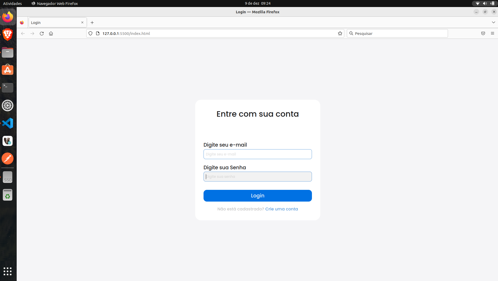

### Mão na massa - 002
- Autor: José Fortes

### Referência do Projeto Original
- Link - https://www.youtube.com/watch?v=hd55g9183Os
- Treinamento de HTML e CSS: Crie uma página de login | Mão na massa - 002

### Instalações
- VS Code
 
### Estrutura do Curso

